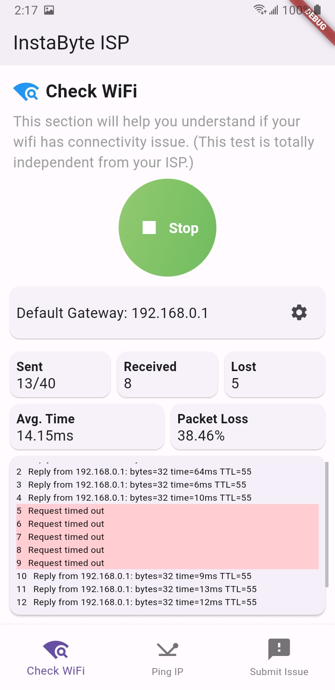

# InstaByte ISP (Wi-Fi Quality Analyzer)

Welcome to the Wi-Fi Quality Analyzer, a Flutter app designed to assess the stability of your local Wi-Fi connection by pinging the gateway. This app provides real-time insights into data loss and offers users the ability to report issues to their ISP's support team. Additionally, users can access suggestions on resolving connection issues independently.

## Watch the Demo Video on YouTube
[](https://www.youtube.com/watch?v=-EvuPjagxWU)

## How it Works

### Method 1: Pinging the Gateway with No Data Loss
![Screenshot 1]


The app initiates a ping to the local Wi-Fi router's gateway IP, ensuring a stable connection with no data loss. The result is displayed on the app screen.

#### Method 1 (Output): No Data Loss Modal
![Screenshot 2]


Upon completing the ping with no data loss (0% data loss), a modal is presented, confirming the robustness of the Wi-Fi connection.

### Method 2: Pinging with Data Loss Detected
![Screenshot 3]


The app performs another ping to the default gateway IP, this time detecting data losses. The result is displayed on the app screen.

#### Method 2 (Output): Packet Loss Detected Modal
![Screenshot 4]


Following the ping with data loss, a modal is shown, indicating the percentage of data loss. Users can use this information to assess the severity of the issue.

## Getting Started

To use the Wi-Fi Quality Analyzer:

1. Clone the repository.
   ```bash
   git clone https://github.com/akmmirazhossain/instabyte-isp-flutter
